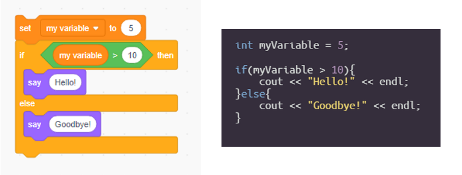

# 🐱‍💻 Introduction to C++ Continued

## 🧱 Blocks vs. C++

Last week, we looked at some examples in`C++`involved branching using if statements and looping using for loops. These might have looked kind of complicated, but if you've coded in blocks before, they might be more familiar than you think!

Below, let's look at an example of branching where if our variable is more than 10, we say Hello! Otherwise \(if our variable is less than or equal to 10\), we say Goodbye! in blocks and in `C++`.

These look pretty similar, right?

Now let's look at an example that looks a little more different. Below is an example where we want to say Hello! 10 times, which we can do using looping. There's more than one way to loop in blocks and `C++`, but this shows one example.

We can see in this diagram that the C++ version looks a little more complicated, but it is doing the same thing! The variable `i` starts at **0**, and every time we loop, we add **1** to `i`, until we get to **10** where we stop looping.

