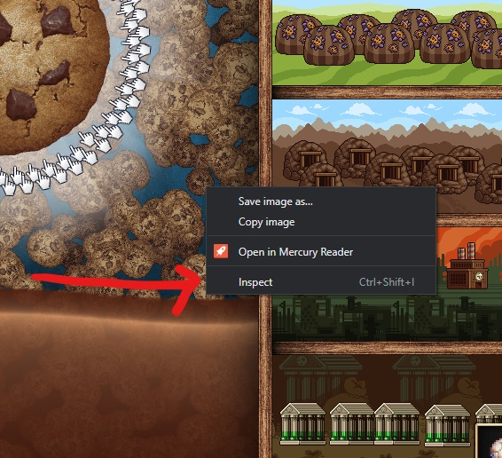
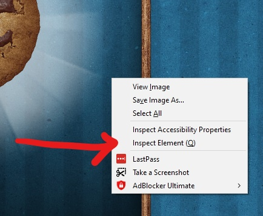
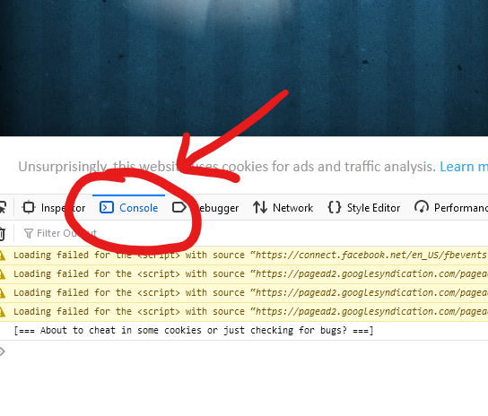

# 🍪 Cookie Clicker

## 🎳 Getting Started with Game Design With Cookie Clicker

Cookie clicker is a **Puzzle-based** game \(this type of puzzle game is called an incremental game\) where you have to make cookies, and then you can spend those cookies on upgrades that help you make more cookies!


The Javascript console can be used to run Javascript code on a local version of the game. This in no way affects servers and infrastructure outside of your computer. This method is often used by web-developers to change interface settings or simulate more complicated data distribution without making changes to the product clients and users can see.  


### 🐱‍💻Using Our Programming Skills Get Cookies

Cookie clicker is fun, it's also really easy \(and totally legal\) to hack 👩‍💻! To get started select instructions for the browser you are using below.



#### 🔍 Opening The Javascript Console

To open the **Hacker** tools:

1. Right-click on the cookie clicker window
2. Select Inspect 
3. **Bonus:** for extra _hacker_ points you can press \(ctrl+shift+i\)



#### 🎪 The Javascript Console is Now Open

And it looks like this:





#### 🔍 Opening The Javascript Console

To open the **Hacker** tools:

1. Right-click on the cookie clicker window
2. Select "**Inspect Element**" \(or Press: **Q**\)
3. Select **Console** in the header of the window that opens



#### 🐱‍🐉This is what will open on step 2


#### 🤳Selecting Console

This is where we can do the fun stuff!





#### 🔍open the **Hacker** tools:

1. Right-click on the cookie clicker window
2. Select Inspect 
3. **Bonus:** for extra _hacker_ points you can press \(ctrl+shift+i\)


#### 🎪 The Javascript Console is Now Open

And it looks like this:





If you are not using **chrome, firefox, or Edge.** Please check if one of those options is installed on your computer. 


If one of the above options is not installed, please reach out to a coding club volunteer for assistance!





From this point on I will be assuming that you are using _**chrome**_ in all of my illustrations. **Things may look a bit different for you**, but the commands and instructions will all be the same from here on out 🚀!


### 🔊 The Commands

At this point, we can start issuing commands to change the game!

### **🥽Here Are Some Example Commands:**

The first order of business is getting some cookies so that we can buy some upgrades 🏹!

#### 🎉 This Command Set Us At 1 Million Cookies 

```javascript
Game.cookies = 1000000;
```



There is a problem though... If we have more than 1 Million cookies, this command will delete our cookies, and set us back to 1 million 😱. But wait... there is a better way.


#### 🎈This Command Gives Us 1 Million MORE COOKIES!!!! 🎊🎉🎊

This command will add 1 million cookies to our current cookie count!

```javascript
Game.cookies += 1000000;
```



This command makes it so that we always end up with more cookies 👩‍🚀! Can you make the command give you more than a million cookies?


#### 🥇 Win The Game With One Command 


🍖Warning this command has been hidden by the coding club cookie ninjas to prevent **@samerickson** from "Ruining all the fun" \(RuinTheFun\). You will have to find this command on your own!


### 🤔 Why Do The Game Developers Let You Do This?

The game developers use the **Javascript console** to allow them to test new and existing features without having to replay hours and hours of the game after resetting their progress.

#### 🦺 Why Is This Important?

This is just one aspect of developing games that we need to think about when we make them. And our games are going to be making use of javascript!


😧Do not worry if programming is difficult for you! We are going to be using [**Scratch**](https://scratch.mit.edu/)**!** If you want to get started with making your own game, you can go to the next lesson using the link below.




### 🎯 It's Challenge Time!

Now that you know how to give yourself items in the game I have a couple of challenges for you!

