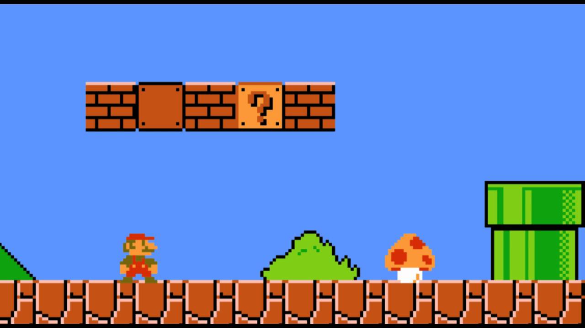
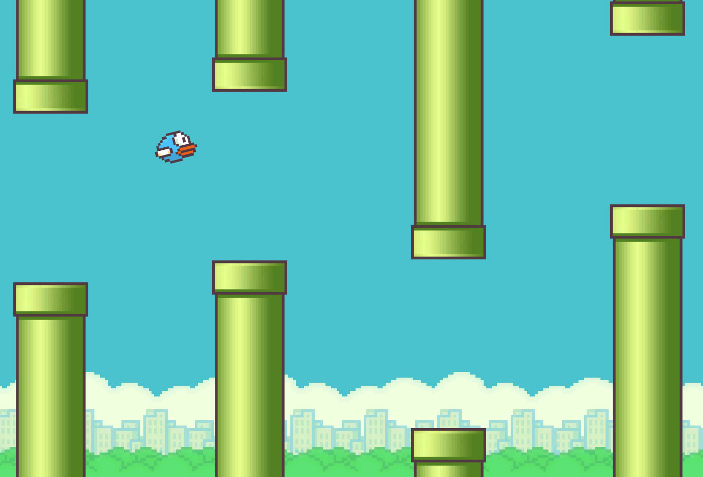
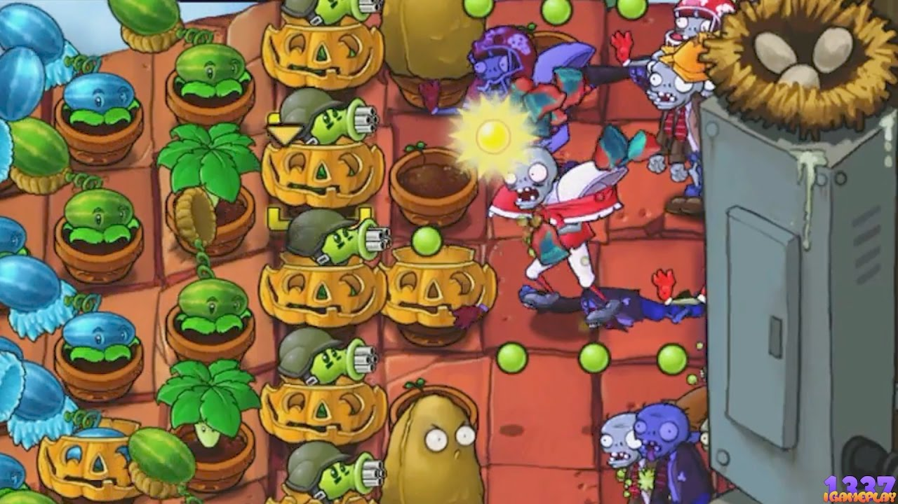
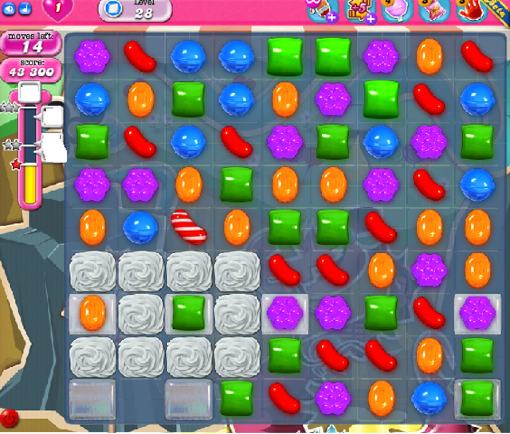
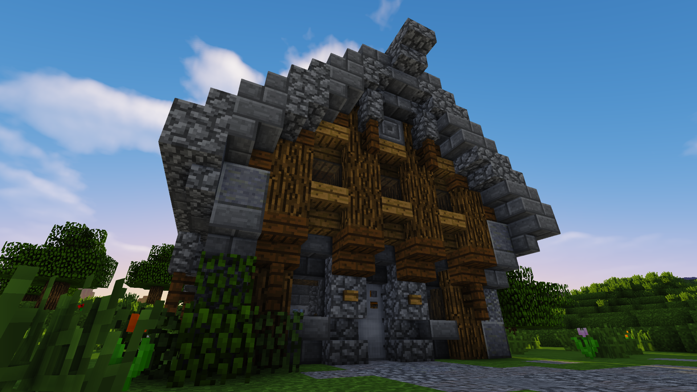
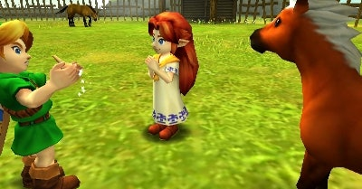
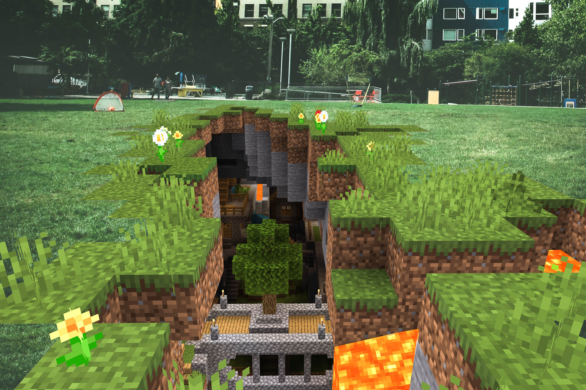
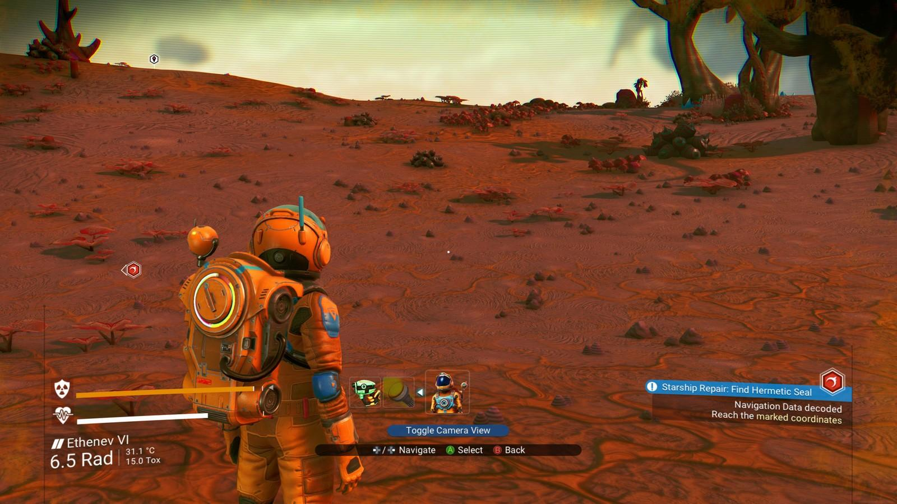

# 🎮 Making Games

## 🌠 How to Make Video Games


Warning: making videogames is very difficult and highly addictive!


This week's coding club is all about games! We have learned a little bit about programming, and now it is time to get started making our own projects. 

### 🧐 What is a Video Game?

Video games come in many different shapes and forms. Here are a couple of video game genres that you may be familiar with:



**Platform games** \(sometimes called _sidescrollers_\) are games where games takes place on a **2D** screen, where the player can move through the levels by jumping around on various platforms. Below are some examples of popular side scroller games:

####  🏰Super Mario Bros

Super Mario Bros is a classic platform-based side scroller where Mario is tasked with overcoming various enemies and obstacles within a time limit in order to save Princess Peach.  

#### 🐧 Flappy Bird

Flappy bird is a survival-based sidescroller game where the objective is to make it through as many pipes as you can without touching them.

####  ☝ Your turn! 

Did **@samerickson** leave out your favourite platform-game? Let him know in the **Discord** on the **\#💻general** channel.



**Puzzle games** are when the player has to solve a problem in order to progress through the levels. Below are some popular puzzle games that you may have seen before:


Note that most video game genres make use of puzzles, but we say that the video game itself is a puzzle game if the primary method of progressing through the game is by completing puzzle-based challenges.      


#### 🧟‍♀️ Plants Vs. Zombies

Plants vs zombies is a puzzle based game where your task is to select the perfect combination of plants to protect your house from zombie attacks!

#### 🍬 Candy Crush

Candy crush is a puzzle-based game where the player has to combine a bunch of candies that are the same colour in order to complete a number of mini-challenges for each level. These mini-challenges include:

* Clearing all the jelly
* Using a set number of power-ups
* Combining a set number of candies that are a specific colour

####  ☝ Your turn! 

Did **@samerickson** leave out your favourite puzzle game? Let him know in the **Discord** on the **\#💻general** channel.



**Adventure games** are game that involve exploration of a virtual world. s. Some examples of Adventure games are listed below:


**Note:** Adventure games often make use of game mechanics from other videogame styles, to give the player a more immersive experience that resembles the _real-world_


#### 🌹 Minecraft

Minecraft is a game where you can explore and create the world you live in one block at a time!


Do you play Minecraft? Have you made something cool! Send a picture to **@samerickson** I would love to see it \(or maybe you could write about it in the **\#📜code-show-and-tell** channel\)!


#### 🧝‍♂️ Legend of Zelda

Legend of Zelda is a game where you play a character named link, and you have to battle a number of monsters and solve puzzles to make your way through 9 dungeons.  

#### ☝ Your turn!

Did **@samerickson** leave out your favourite adventure game? Let him know in the **Discord** on the **\#💻general** channel. 



**Sandbox games** are just like adventure games only they allow you to change the virtual world that you are playing in!

#### 🌹 Minecraft

Minecraft is a game where you can explore and create the world you live in one block at a time!


Do you play Minecraft? Have you made something cool! Send a picture to **@samerickson** I would love to see it \(or maybe you could write about it in the **\#📜code-show-and-tell** channel\)!


#### 🌌 No Man's Sky

No man's sky is an adventure-based survival game where players have to make use of their environments to survive on various planets and space!

#### ☝ Your turn!

Did **@samerickson** leave out your favourite sandbox game? Let him know in the **Discord** on the **\#💻general** channel. 



#### 🌴 It's Your Turn

There are many other genres of video games to choose from. If you made it to this part of the lesson, send a message to the Discord server and let **@samerickson** know which genres he forgot!



### 👩‍💻 How to Get Started

Making video games can be a lot of work. You need to:

* Come up with an idea for a game
* Write a story and think about what players can/cannot do in your game
* Make the artwork for your game
  * Design the levels
  * Design the player
  * Design the enemies
  * Design all of the NPC's \(Non-Playable Characters\)
* Write all the code that makes your video game work!

That sounds like a lot! But no worries! This week we are going to look at the code and level design, then you will be ready to start making your own game!


**As always:** If you get stuck at any point were are here to help you!


